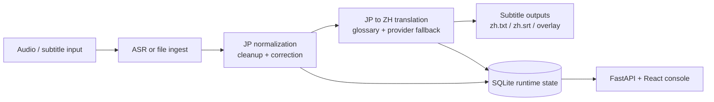

# Real-Time Subtitle Daemon & Console

Low-latency live subtitle daemon for Japanese-to-Chinese streaming workflows.
It combines live or file-based subtitle ingestion, multi-stage LLM processing,
adaptive queue control, and a small React web console for live monitoring.

## Translation workflow



## What I personally implemented

- End-to-end daemon runtime for subtitle ingest, queueing, deadline handling, and output generation
- Two-stage LLM processing flow for JP cleanup/correction and JP-to-ZH translation
- Provider routing and fallback logic across multiple OpenAI-compatible endpoints
- SQLite-backed runtime state, trace logging, and operator-facing FastAPI APIs
- React console for monitoring live status, editing cues, adjusting delay, and hot-updating terminology

## What this project shows

- Real-time subtitle processing with deadline-aware scheduling
- Multi-provider LLM routing across xAI, DeepSeek, Qwen, and z.ai-compatible endpoints
- Speechmatics ASR integration for live audio ingestion
- Runtime observability through a FastAPI console and traceable state store
- Practical subtitle rendering constraints for real streaming setups

## Highlights

- File mode and live ASR mode
- JP normalization / correction stage plus JP-to-ZH translation stage
- Adaptive batching and deadline pressure signals to keep subtitles usable under load
- Configurable glossary and name whitelist system
- Browser-based console for queue state, cue details, metrics, and terminology updates
- SQLite-backed runtime state and event persistence

## Repository layout

```text
live_sub_daemon/     Core daemon, pipeline, runtime control, console server
web_console/         React + Vite frontend for the live console
tests/               Unit tests for config, pipeline, console, and storage logic
tools/               Local benchmarking and replay helpers
config.toml.example  Public-safe example configuration
```

## Quick start

### 1. Install Python dependencies

```powershell
pip install -r requirements.txt
```

Optional for tests:

```powershell
pip install -r requirements-dev.txt
```

Optional for live Speechmatics mode:

```powershell
pip install speechmatics-rt
```

### 2. Create a local config

```powershell
Copy-Item .\config.toml.example .\config.toml
```

Set provider credentials through environment variables such as:

```powershell
$env:XAI_API_KEY = "your_api_key"
$env:DEEPSEEK_API_KEY = "your_api_key"
$env:DASHSCOPE_API_KEY = "your_api_key"
$env:SPEECHMATICS_API_KEY = "your_api_key"
```

### 3. Run the daemon

File-polling mode:

```powershell
python -m live_sub_daemon --config config.toml --input-srt jp.srt --input-txt jp.txt --zh-txt zh.txt --zh-srt zh.srt
```

The overlay text output is written to `zh.txt`, which can be consumed by OBS text sources.

### 4. Run the web console

Backend console API is served by the daemon when `[console].enabled = true`.

Frontend:

```powershell
cd .\web_console
npm install
npm run build
cd ..
```

### 5. Seed a screenshot-ready console demo

If you want a non-empty console for portfolio screenshots without a live stream,
run the seeded demo workspace:

```powershell
python .\tools\run_console_demo.py
```

This starts a local console with realistic sample states including displayed cues,
manual edits, deleted cues, fallback routing, inflight work, and pending items.
Open the printed URL in your browser and capture the console there.

## Config notes

- `config.toml.example` is safe to publish and uses environment variables for secrets.
- `source.mode` supports `file` and `speechmatics`.
- `llm.provider` supports `xai`, `deepseek`, `qwen`, and `zai`.
- Glossary and whitelist files can be swapped for different domains without code changes.

## External tools

This public repo does not bundle local runtime binaries or workstation-specific directories.
If you want the full relay / broadcast setup, install those tools separately on your own machine:

- FFmpeg
- OBS
- MediaMTX
- Optional audio routing tools for live capture

The included `.ps1` / `.bat` scripts are examples from the working setup, but the public repo intentionally omits bundled binaries and local install directories.

## Running tests

```powershell
python -m unittest discover tests
```

## Why this repo exists

This project is a practical systems project rather than a toy demo.
It was built to keep subtitles usable in real live-stream conditions where timing,
queue pressure, provider latency, and terminology consistency all matter at once.
